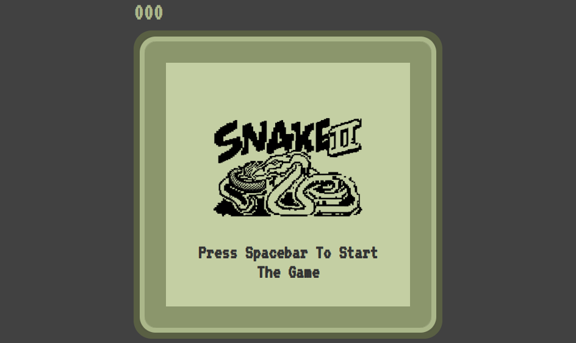

<h1 align="center">Snake Game</h1>
<p align="center">Eat the food, then grow.</p>

<div align="center">
    
    
</div>

## :computer: In your machine
It's easy get this code to your machine.

You clone this repo:
```bash
git clone https://github.com/hanako-yamada/snake-game.git
```

Inside the repo folder, just open `index.html` in your favorite browser.

Easy, right? :wink:

## :video_game: Playing


Want to play? [Click here!](https://hanako-yamada.github.io/snake-game)

## :technologist: Contributing
Pull requests are welcome. For major changes, please open an issue first to discuss what you would like to change.

Please make sure to update tests as appropriate.

## :scroll: License
[WTFPL](LICENSE)
